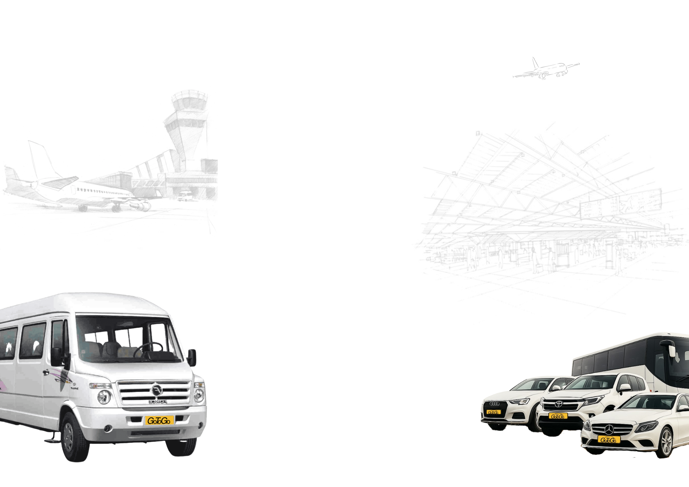

<!DOCTYPE html>
<html lang="en">
<head>
  <meta charset="UTF-8" />
  <meta name="viewport" content="width=device-width, initial-scale=1.0"/>
  <title>Your GoToGo Ticket</title>
  <link rel="shortcut icon" href="assets/GoToGo Final Logos/GoToGo Final Logos/G2G Fleet - Inverse Black.png" type="image/x-icon">
  
  <link href="https://fonts.googleapis.com/css2?family=Montserrat:wght@400;600;700&display=swap" rel="stylesheet">
  
</head>
<body>

  

  <h3>Download Your Ticket</h3>

  <!-- Fixed-scale container -->
  

    

      <!-- Header -->
      

        
        
SHUTTLE TO AIRPORT

      

      

        

        
NAME OF PASSENGER

        
JOHNEY LIVER D’CRUIZE

        

        

          
TICKET #

          
G2G-AS-SH-001

        

      

      

        

        
SHUTTLE BOARDING TIME

        

          

            6 Am
          

          

            7 Am
          

          

            8 Am
          

        

        

        

          
DROP TERMINAL

          

            

            T1
          

          

            T2
          

          

            T3
          

          

        

      

      

        

          
PICKUP DATE

          
MAY 01

        

        

          
PICKUP LOCATION

        
SUNDAY HOTEL

        

        
      

      

        

          
PAYMENT STATUS

          
PAID

        

        

        
PICKUP ADDRESS

        
Sec 66, GGN

        

        
      

      

        
Travel Assistance: (+91) 7065 650 650

        

          For International Travel, please arrive 4 hours before the flight.
For Domestic Travel, please arrive 3 hours before the flight. 
Please take care of your belongings while on board.
        

      

      

        <h4 style="margin-bottom: 5px; font-size: 12px;">TERMS & CONDITIONS</h4>
        <ul style="font-size: 8px; padding-left: 20px; text-align: justify;">
  <li><strong>Seating Policy:</strong> Seats are not pre-assigned. Seating is strictly on a first-come, first-served basis.</li>
  <li><strong>Departure Timings:</strong> The shuttle will depart strictly as per the scheduled time. There will be no additional waiting. Passengers are requested to arrive at the pickup point well in advance to avoid missing the shuttle.</li>
  <li><strong>No-Show Policy:</strong> In case of a no-show, the booking will be considered fully charged and non-refundable.</li>
  <li><strong>Cancellation & Transfer:</strong> This ticket is non-cancellable, non-transferable, and non-refundable under normal circumstances.</li>
  <li><strong>Exceptions (Force Majeure):</strong> In the event of unforeseen conditions (e.g., natural disasters, strikes, etc.) affecting service operations, alternate arrangements or refunds will be offered based on the situation and feasibility.</li>
  <li><strong>Refund Processing:</strong> If a refund is applicable, it will be processed within 14 working days.</li>
  <li><strong>Service Disclaimer:</strong> GoToGo shall not be held responsible for flight delays, traffic disruptions, or external factors impacting pickup/drop timing.</li>
  <li><strong>Customer Support:</strong> For assistance, please contact our helpline: +91 7065 650 650.</li>
</ul>

      

    

      
    

    

  

  <button class="download-btn" onclick="generatePDF()" style="margin-bottom: 10px;">Download Ticket</button>

  

</body>
</html>

<!-- 
 -->